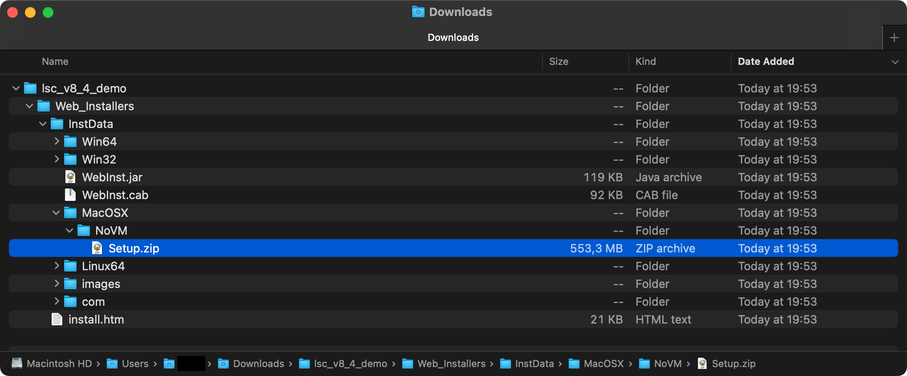

# LOGO! Soft Comfort for M-series Macs

This makes the Intel macOS version run on Apple silicon (Rosetta + Intel Java), so it doesn't instantly close.

## Disclaimer

I don't own LOGO! Soft Comfort and I'm not affiliated with Siemens. This repo doesn't include their software. It only patches the launcher. LOGO! / LOGO! Soft Comfort are Siemens trademarks.

## Downloads

1) [LOGO! Soft Comfort v8.4 Demo (Siemens)](https://support.industry.siemens.com/cs/document/109826921/logo!soft-comfort-v8-4-demo?dti=0&lc=en-GB)  
2) [Java 11+ (Azul Zulu)](https://www.azul.com/core-post-download/?endpoint=zulu&uuid=f6d9f03c-44f3-49d0-976f-e11561997a32) (pick **macOS x64 / Intel**, download the `.pkg`)

## Install

1) Download + unzip the Siemens demo (you'll get `lsc_v8_4_demo`)
2) Install Java (double-click the `.pkg`, click through)
3) Install LOGOComfort using Siemens' installer (`Setup.zip` is here):
   - `lsc_v8_4_demo/Web_Installers/InstData/MacOSX/NoVM/Setup.zip`



4) After it's installed, paste this into Terminal:

```bash
set -euo pipefail

# CHANGE THIS ONCE (after you put this repo on GitHub)
REPO="YOUR_GITHUB_USER/YOUR_REPO"
if [[ "$REPO" == "YOUR_GITHUB_USER/YOUR_REPO" ]]; then
  echo "Edit REPO=\"...\" first (your GitHub repo), then re-run."
  exit 1
fi

TMPDIR="$(mktemp -d)"
ZIP_URL_MAIN="https://github.com/$REPO/archive/refs/heads/main.zip"
ZIP_URL_MASTER="https://github.com/$REPO/archive/refs/heads/master.zip"

if ! curl -fsSL "$ZIP_URL_MAIN" -o "$TMPDIR/repo.zip"; then
  curl -fsSL "$ZIP_URL_MASTER" -o "$TMPDIR/repo.zip"
fi
ditto -xk "$TMPDIR/repo.zip" "$TMPDIR"

REPO_DIR="$(/usr/bin/find "$TMPDIR" -maxdepth 1 -type d -name '*-main' -print -quit || true)"
if [[ -z "${REPO_DIR:-}" ]]; then
  REPO_DIR="$(/usr/bin/find "$TMPDIR" -maxdepth 1 -type d -name '*-master' -print -quit || true)"
fi
if [[ -z "${REPO_DIR:-}" ]]; then
  echo "Couldn't find the extracted repo folder in: $TMPDIR"
  exit 1
fi
bash "$REPO_DIR/scripts/quickfix.sh"
```

Notes:
- The script finds `LOGOComfort.app` automatically (it does NOT have to be in `/Applications`).
- If it says Java is missing, install **Intel (x64/x86_64) Java 11+** from the Zulu link above.
